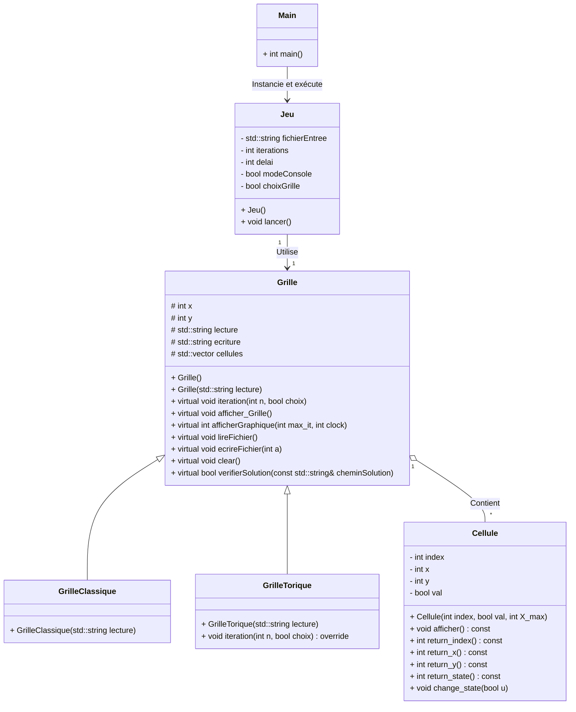

```mermaid
classDiagram
    class Cellule {
        - int index
        - int x
        - int y
        - bool val
        + Cellule(int index, bool val, int X_max)
        + void afficher() const
        + int return_index() const
        + int return_x() const
        + int return_y() const
        + int return_state() const
        + void change_state(bool u)
    }

    class Grille {
        # int x
        # int y
        # std::string lecture
        # std::string ecriture
        # std::vector<Cellule> cellules
        + Grille()
        + Grille(std::string lecture)
        + virtual void iteration(int n, bool choix)
        + virtual void afficher_Grille()
        + virtual int afficherGraphique(int max_it, int clock)
        + virtual void lireFichier()
        + virtual void ecrireFichier(int a)
        + virtual void clear()
        + virtual bool verifierSolution(const std::string& cheminSolution)
    }

    class GrilleClassique {
        + GrilleClassique(std::string lecture)
    }

    class GrilleTorique {
        + GrilleTorique(std::string lecture)
        + void iteration(int n, bool choix) override
    }

    class Jeu {
        - std::string fichierEntree
        - int iterations
        - int delai
        - bool modeConsole
        - bool choixGrille
        + Jeu()
        + void lancer()
    }

    class Main {
        + int main()
    }

    %% Relations entre classes
    Grille <|-- GrilleClassique
    Grille <|-- GrilleTorique
    Grille "1" o-- "*" Cellule : Contient
    Jeu "1" --> "1" Grille : Utilise
    Main --> Jeu : Instancie et exécute


```
