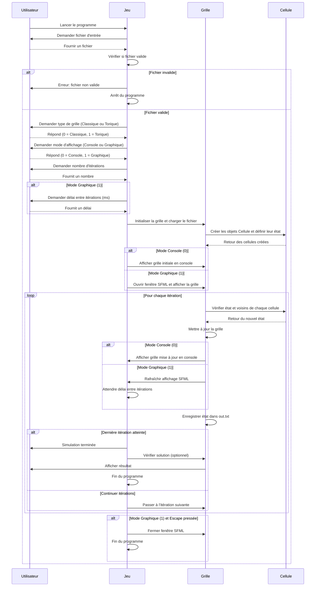

```mermaid
sequenceDiagram
    participant Utilisateur
    participant Jeu
    participant Grille
    participant Cellule

    %% Début du programme
    Utilisateur ->> Jeu: Lancer le programme
    Jeu ->> Utilisateur: Demander fichier d'entrée
    Utilisateur -->> Jeu: Fournir un fichier
    
    Jeu ->> Jeu: Vérifier si fichier valide
    alt Fichier invalide
        Jeu ->> Utilisateur: Erreur: fichier non valide
        Jeu ->> Jeu: Arrêt du programme
    else Fichier valide
        Jeu ->> Utilisateur: Demander type de grille (Classique ou Torique)
        Utilisateur -->> Jeu: Répond (0 = Classique, 1 = Torique)
        Jeu ->> Utilisateur: Demander mode d'affichage (Console ou Graphique)
        Utilisateur -->> Jeu: Répond (0 = Console, 1 = Graphique)
        Jeu ->> Utilisateur: Demander nombre d'itérations
        Utilisateur -->> Jeu: Fournit un nombre

        alt Mode Graphique (1)
            Jeu ->> Utilisateur: Demander délai entre itérations (ms)
            Utilisateur -->> Jeu: Fournit un délai
        end
        
        Jeu ->> Grille: Initialiser la grille et charger le fichier
        Grille ->> Cellule: Créer les objets Cellule et définir leur état
        Cellule -->> Grille: Retour des cellules créées
        
        alt Mode Console (0)
            Jeu ->> Grille: Afficher grille initiale en console
        else Mode Graphique (1)
            Jeu ->> Grille: Ouvrir fenêtre SFML et afficher la grille
        end
        
        loop Pour chaque itération
            Grille ->> Cellule: Vérifier état et voisins de chaque cellule
            Cellule -->> Grille: Retour du nouvel état
            Grille ->> Grille: Mettre à jour la grille
            
            alt Mode Console (0)
                Grille ->> Jeu: Afficher grille mise à jour en console
            else Mode Graphique (1)
                Grille ->> Jeu: Rafraîchir affichage SFML
                Jeu ->> Jeu: Attendre délai entre itérations
            end
            
            Grille ->> Grille: Enregistrer état dans out.txt
            
            alt Dernière itération atteinte
                Jeu ->> Utilisateur: Simulation terminée
                Jeu ->> Grille: Vérifier solution (optionnel)
                Grille ->> Utilisateur: Afficher résultat
                Jeu ->> Jeu: Fin du programme
            else Continuer itérations
                Jeu ->> Grille: Passer à l’itération suivante
            end
        end
        
        alt Mode Graphique (1) et Escape pressée
            Jeu ->> Grille: Fermer fenêtre SFML
            Jeu ->> Jeu: Fin du programme
        end
    end
```
